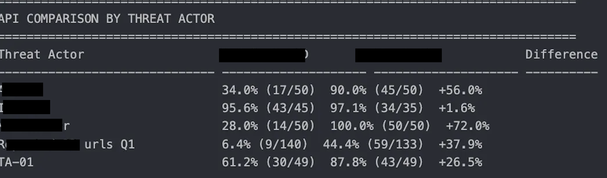
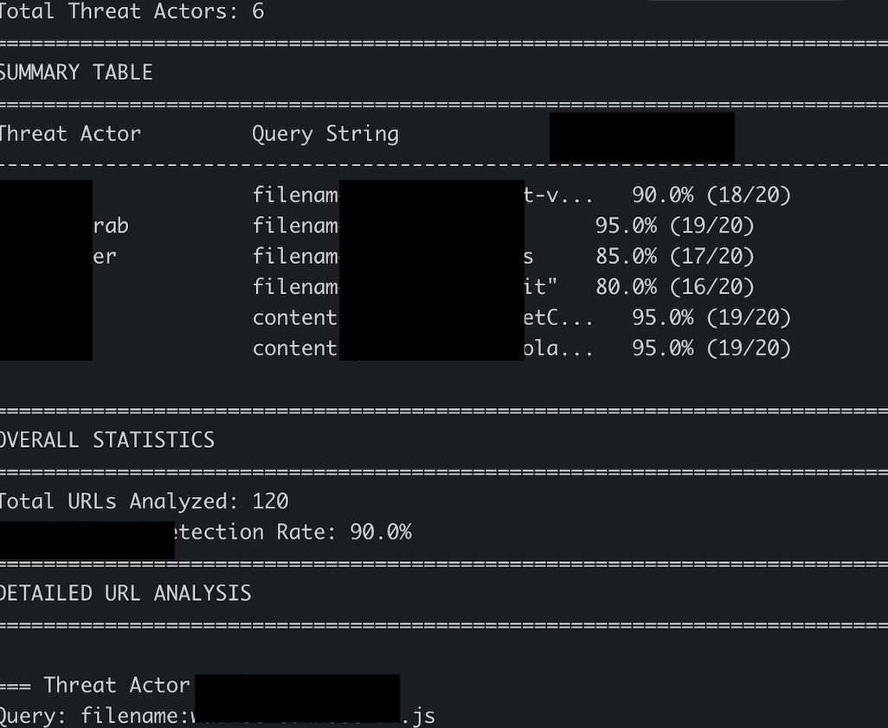

# Endpoint Security: My Journery Building a Detection Rate Bot
## Intro

Without revealing too much about the custom tool I built in particular, I want to walk through the high level steps I performed so any researcher can build their own bot to detect and report stats on threat actor activites. 

My detection rate bot captured newly deployed domains from threat actors and fed each of these domains through various 3rd party APIs. The output my bot returned includes detection rate stats of each of the third parties and a full report of which domains were detected by the 3rd party APIs. I set up this bot to be performed weekly and to send my team and I, this report. * I redacted key information about threat actors and 3rd party tools used. 




## Tech stack

You will need to have some technical experience and access to a few tools in order to recreate this kind of bot:

- Python programming experience (cusor ai lol) 
- API access to an infrastructure search engine (ex: shodan, zoomeye)
- API access to 3rd party domain flagging tools 
- webhook to your platform of choice (slack, discord, ms teams)
- AWS cloud experience


## Building the detection bot 

When building this tool, my primary focus was on automation. I wanted this to be easy to set up for anyone on my team. 

The approach I took was to build it as a CLI tool. I'd be able to automate later with a cron job, but I'd also be able to use it manually whenever I needed too. 

I built this to have 4 main components: 
- URL collection using search engine tool
- URL analysis using 3rd party detection tools 
- Reporting 
- Logging 

See my psudocode for how I wanted this bot to operate. 

```
# organize threat actor IOCs into searchable content 
# API call to pull latest ( within 7 days) domains based off the IOCs 
# Take each threat actor domain and feed them through 3rd party APIS 
# Log each response from above API calls 
# Analyze logged responses from above API calls
# Create caching system to prevent duplicated calling 
# Create DB to evaluate data over time
# Create report from analysis 
# Send Analysis via webhook 
```

Once I had this simple CLI tool implemented, I could set up the automated reporting. 

I used an AWS EC2 instance to host the bot, including it's sqlite DB. 

Within the EC2 instance I scheduled a cron job to execute the CLI tools every week. 

I then used an AWS lambda function + EventBridge schedular to optomize the bot's cost. This step isn't absolutley necessary but I figured I might as well learn how to create a bot on a budget. 

## Conclusion 

If you complete the above steps, you can get fancy and add better features to your bot. I eventually modified the bot to show overall statistics a bit better. Overall the project singificantly impacted how engineers and decision makers would select 3rd party vendors. After selection this tool was used to track 3rd party vendors progress. 




## Lessons Learned 
- Leveraging cursor ai to become a 10X security engineer
- DB optimization / building my own caching machanism
- Importance of extensive logging for in house tools
- Building custom alerts for teams using webhooks
- Using cronjobs for a production ready alerting system 
- AWS basics (EC2s, Lambda functions, EventBridge scheduler)


