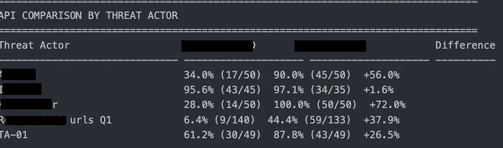
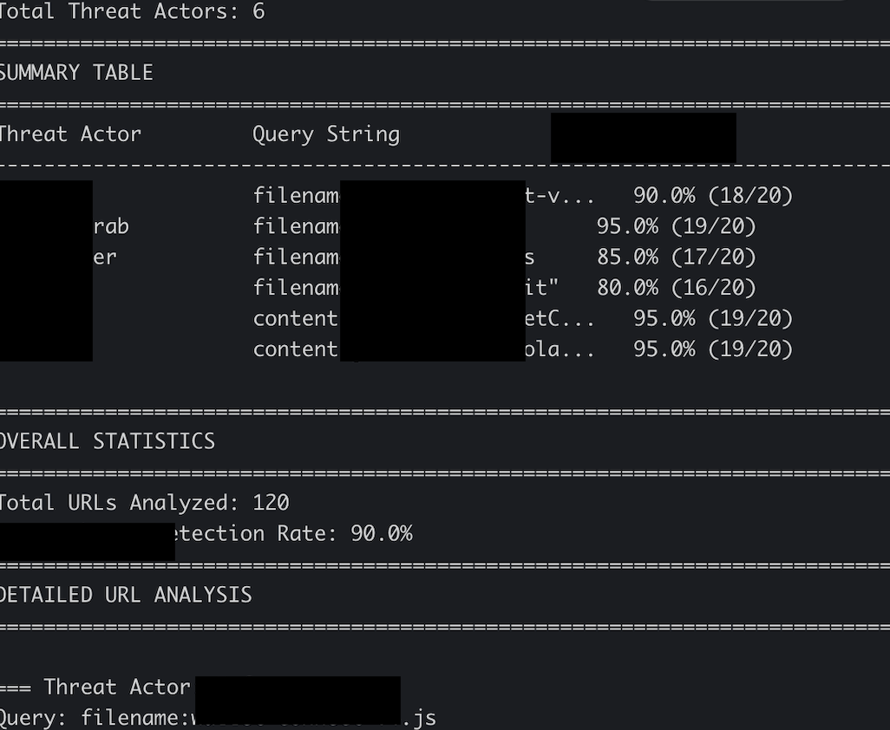

# Detection Engineering: Building a Detection Rate Bot

## Intro


I want to walk through the high-level steps I took to build a detection rate bot. This tool can help any researcher who is interested in learning how to automate the process of detecting when a threat actor deploys a domain AND provide stats for tools that do a great job at flagging said domains.


At a high level, this bot uses custom queries to monitor when a threat actor deploys a domain. Once a cluster of domains is collected, they are fed into various third-party security tools. The tool returns a report on which third-party tools do the best at flagging or detecting threat actor domains. I set up this bot to run throughout the week and send my team and me a report. *Key info about threat actors and third-party tools has been redacted from the screenshot below.

<center></center>


## Tech Stack + Requirements


Some things you'll need in order to recreate this kind of bot:

- Python programming experience (Cursor AI is your friend, lol)
- API access to search engines focused on connected devices (e.g., Shodan, ZoomEye)
- API access to third-party domain flagging tools
- Webhook to your platform of choice (Discord)
- AWS cloud basics

## Building the Detection Bot


When building this tool, my primary focus was automation. I wanted it to be easy for anyone on my team to set up.


I built it as a CLI tool. That way, I could automate it later with a cron job, but also run it manually whenever needed.


The bot has four main components:
- URL collection using a search engine tool
- URL analysis using third-party detection tools
- Reporting
- Logging


Here's my pseudocode for how I wanted this bot to operate:

```
# Organize threat actor IOCs into queries that can be used on OSINT platforms
# Set up an API to pull the latest threat actor domains based on the IOCs
# Feed each threat actor domain through third-party APIs
# Log each response from the third-party APIs
# Analyze logged responses
# Create a DB to store logged data over time
# Create a caching system to prevent duplicate calls
# Set up the tool to be performed in batches
# Create an analysis and generate a report from each batch
# Send report via webhook
```


Once I had this simple CLI tool implemented, I set up automated reporting. I deployed this tool on an AWS EC2 instance and scheduled a cron job to execute the CLI tool every X amount of days. I used an AWS Lambda function plus EventBridge Scheduler to optimize the bot's cost. This step isn't absolutely necessary, but I figured I might as well learn how to build a bot on a budget.


## Outro


If you complete the above steps, you can get fancy and add even better features to your bot. I eventually modified the bot to highlight key statistics. Overall, this project significantly impacted how engineers and decision-makers selected third-party vendors. After selection, this tool was used to track vendor progress over time.

<center></center>

## Helpful Tips


It's important to note that this kind of tool is not useful unless you have done some threat hunting and have been able to distinguish threat actors targeting assets that are important to you. You must have relevant IOCs. One pitfall I've noticed about this tool is that I need to keep it fresh with new IOCs, or stats about threat actors I'm tracking can be heavily skewed.

## Lessons Learned

- Leveraging Cursor AI to become a 10x security engineer
- DB optimization / building my own caching mechanism
- Importance of extensive logging for in-house tools
- Building custom alerts for teams using webhooks
- Using cron jobs for a production-ready alerting system
- AWS basics + AWS resource optimization


