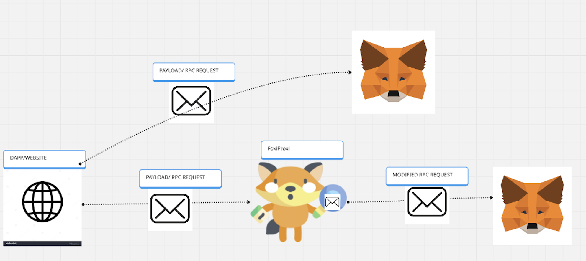
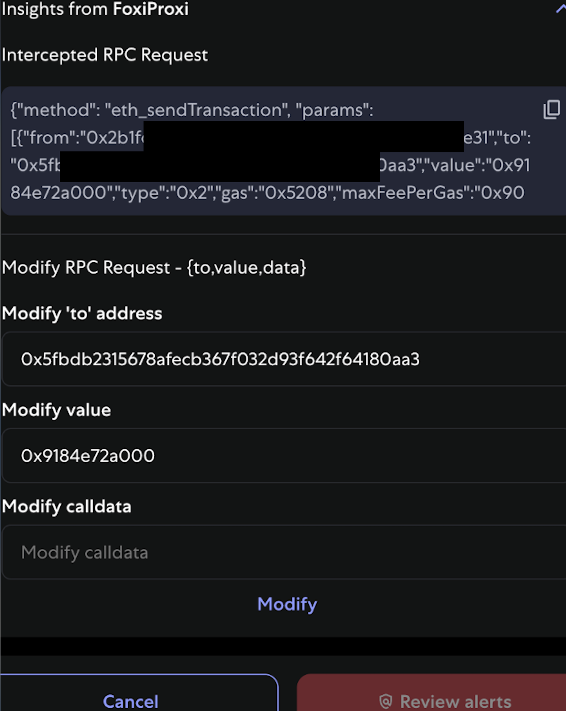

# Building FoxiProxi: Transaction Insights for Crypto Wallets

## Intro

FoxiProxi is a lightweight, privacy-preserving tool designed to empower researchers, bounty hunters, QA engineers, and customer support engineers. It allows them to intercept, modify, and replay transactions in MetaMask. This project aimed to solve critical pain points in crypto wallet security research by providing stealthy and accurate transaction manipulation capabilities without leaking sensitive data to third parties.

As you are reading this you may see the word `snap` mentioned. Snaps are a feature that MetaMask released to allow individual contributors to extend the functionality of a crypto wallet. Contributors have been using snaps to create simulation tools, chain access, AI integration, and security tools. 

## Objective & Features

The primary goal of FoxiProxi is to build a MetaMask Snap that can:

1. **Capture** `eth_sendTransaction` and `eth_signTypedData_v4` RPC calls.
2. **Modify** transaction requests sent from a Dapp before they are normalized by MetaMask.
3. **Preserve Privacy** – No data is sent to any third party.
4. **Remain Stealthy** – Threat actors should not be able to detect or block the use of the proxy.

## Problems FoxiProxi Solves

1. **Prevent Data Collection by 3rd Parties:** Many Web3 extensions collect user data, potentially exposing researcher activity.
2. **Accurate MetaMask Responses:** Existing tools lack the ability to impersonate MetaMask accurately.
3. **Evasion Detection:** Threat actors can often detect and block researchers using traditional proxy or simulation tools.
4. **Modify MetaMask RPC Requests:** There’s no easy way to modify JSON-RPC requests sent to MetaMask without a proxy 
5. **Manual Payload Replay:** Replaying malicious payloads is tedious and inefficient.

## Building FoxiProxi

The repo can be [found here](https://github.com/wzrdk3lly/foxiproxi-snap). 

If you want to learn more about building snaps I suggest [you read the docs](https://docs.metamask.io/snaps/)

Building this snap is pretty straigtforward. The objective is to consume JSON-RPC request that are initially sent to the wallet and then modify these request in any way you see fit. Most wallets normalize and abstract away JSON-RPC request data, so our goal was to capture this raw payload. You can do this with the [transaction insights](https://docs.metamask.io/snaps/features/transaction-insights/) snap feature. 

## Tool in action 

In the transaction below, I have proxied the request to a malicious eth address. With FoxiProxi I can now easily copy, modify, and re-send the modified transaction. 

## Lessons Learned

- Building an integration with limited documentation 
- Working on a team for a production ready tool
- How crypto wallets modify and process RPC request
- Bookmarklets 

