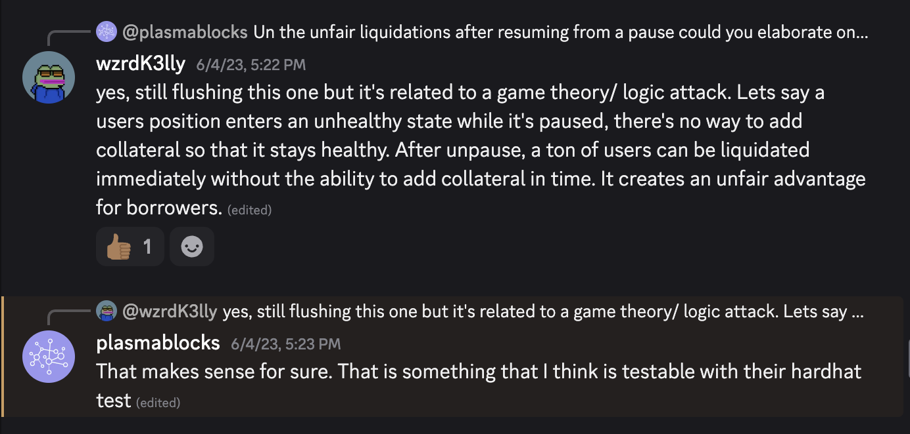
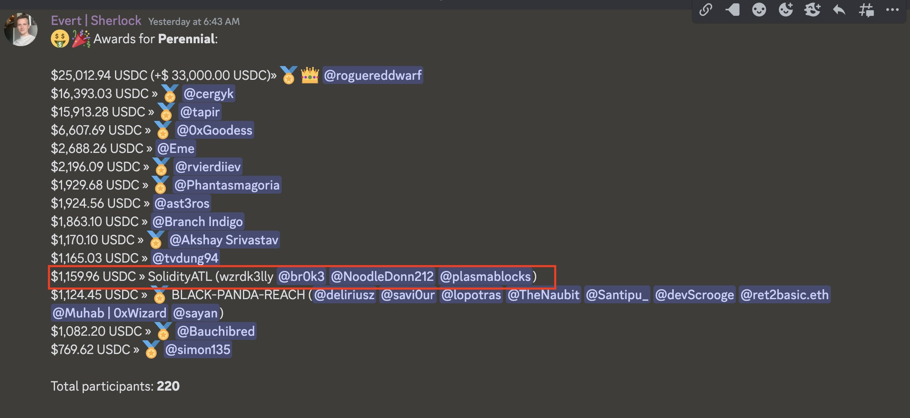

# How we Place top 12 in a bounty contest securing a Billion Dollar protocol

## Intro
Some time ago, a good friend of mine and I decided to join a bounty contest with a few of the students we were teaching. We thought it would be a great learning experience for all of us. We got to learn how to lead an team of security researchers, learn about a new web3 protocol, and our students got to learn the full process of bug bounty huntin for blockchain dapps. Little did we know we submitted a single issue that lead to us winning ~1k USD and placing top 12 amongst 220 participants. See [Our report](https://github.com/sherlock-audit/2023-05-perennial-judging/issues/168) that we submitted. It was also cool to see a protocol (Perennial) we helped secure, move on to do $[3.77B USD in volume](https://defillama.com/protocol/perps/perennial). 

## How did we find the bug 

I hate to be that person but tbh you have to READ THE CODE. Many researchers will try to find the next best thing or the newest strategy to find bugs. I've learned that you find bugs best when you read and understand the code. It will be much easier for you to point out any imperfections. Once you spot an imperfection, set it aside for later to validate.

Validation is where having a team really helps you excel in bounty hunting. I had this theory that an unfair scenario could play out for a majority of the user's of Perennial in the event they needed to pause the protocol. My team did an amazing job at proding and poking at the potential bug to ensure this was a valid issue. 

## Technical Breakdown of the issue
I want to do a quick pause here to help you understand the bug in question. For context, this protocol is a perp (perpetual) trading platform. Perps allow you to make trades on speculated prices of an asset. This protocol also allows traders to use leverage when making their trades. If you are familiar with how leverage works, you will know that you typically have to offer up some form of collateral. This ensures you will be able to cover the trade in the event that the market moves against your opened position. If the market moves against your position, you need to fund your position and add more collateral to keep it in a healthy range. If you fail to keep the collateral in a healthy range, you get liquidated and lose your assets. 

As I began to understand the concept explained to you above, I wondered if there could ever be a scenario where there could be a forced liquidation event amongst a large portion of users. This would be a very bad scenario for both the protocol and users. This scenario could occur due to how the developers handled the pause logic of the protocol. 

A protocol developer may need to pause the protocol to stop an attack, perform upgrades, or perform migrations. When this protocol is paused, traders would have no way to maintain the health of their collateral. When the protocol is unpaused, many positions could have bad health which would lead to many positions getting liquidated. 

## Results 

We submitted the issue and it turned out to be a valid flaw. Our team was awarded a $1K bounty and we placed 12th out of 220 other researchers.  

